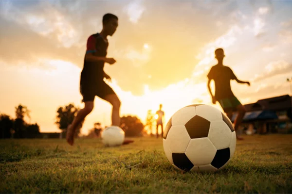

## Achievements

- Figured in top 1.2 percentile in JEE Advanced (AIR 2440) and top 0.5 percentile in JEE Mains (AIR 5582)
- Awarded as Best Team Player for consistently assisting fellow teammates in the workplace
- Won gold in Interdepartmental Chess Competition

<!-- Main -->

<!-- Two -->
<section id="two" class="spotlights">
    <section>
        

            
        

        

            

                <header class="major">
                    <h3>Football</h3>
                </header>
                
I ❤ Football. I engage in playing Football two times per week. I am an avid follower of the Premier League, La Liga, and Bundesliga. Although it may seem unusual, my preferred team is Tottenham Hotspur. Among the players, Son Heung-Min holds a special place as my favorite. Additionally, I greatly enjoy observing the performances of Borussia Dortmund, with Marco Reus often delivering captivating displays on the field.

            

        

    </section>
    <section>
        

            
        

        

            

                <header class="major">
                    <h3>Badminton</h3>
                </header>
                
You can find me with three of my roommates on weekends, holding Yonex rackets and shuttles while working up a sweat.

            

        

    </section>
</section>

