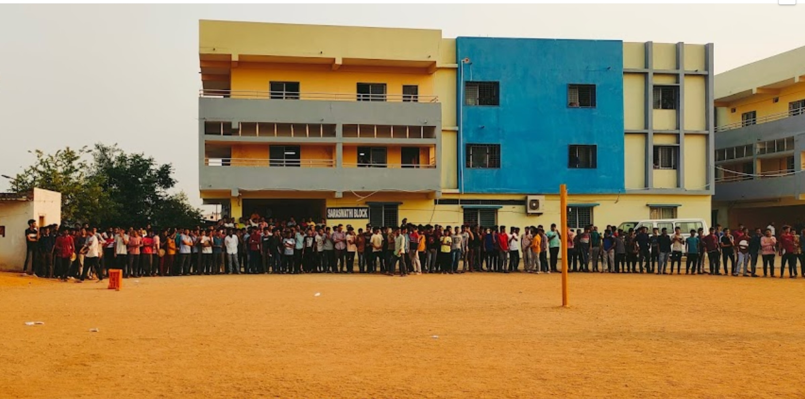
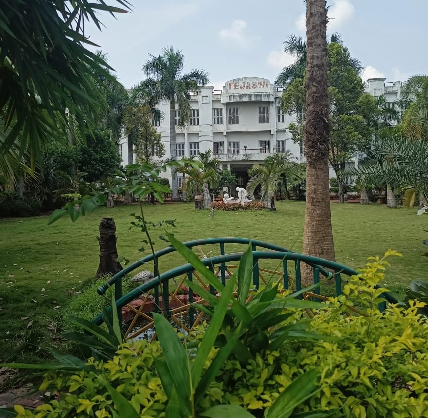

<link rel="stylesheet" href="../assets/css/custom-education.css">

  

    
    

      <strong>IIT Madras</strong>   
      2016 - 2020   
      B.Tech in Civil Engineering   
      GPA: 7.01 / 10
        
      <b>Image Recognition (Guide: Dr. Benny Raphael) Course Project (Jan’19-Apr’19)</b>
      <ul>
        <li>Built an image classification model based on the research paper “Striving for Simplicity: The All Convolutional Net”</li>
        <li>Applied deep learning techniques like CNN and used Max Pooling Techniques for dimensionality reduction</li>
        <li>Achieved an accuracy of 87.51% by tuning hyperparameters and optimizing the sigmoid loss function</li>
      </ul>
      <b>Winter Research Project (Guide: Dr. Gitakrishnan Ramadurai) (Dec’18-Jan’19)</b>
      <ul>
        <li>Examined risk factors affecting ambulance response times (ART) for trauma incidents to derive interventional measures</li>
        <li>Performed data visualization using matplotlib in Python for selecting variables of the MNL Regression model</li>
        <li>Developed a Multinomial Regression model for predicting Ambulance Response Time based on variables</li>
      </ul>
    

  

  

    
    

      <strong>Narayana Junior College</strong>   
      2014 - 2016   
      HSC, Mathematics and Sciences (TSBIE)   
      Score: 976 / 1000
    

  

  

    
    

      <strong>Tejaswi High School</strong>   
      2011 - 2014   
      SSC (TSBSE)   
      GPA: 9.8 / 10
    

  

